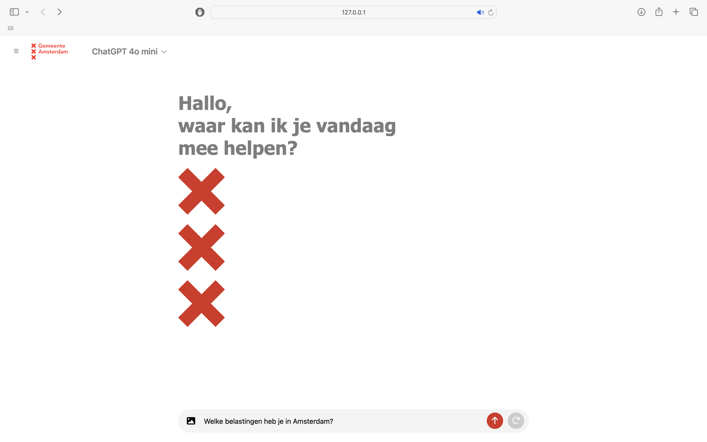

# Amsterdam RAG Chatbot System

Retrieval Augmented Generation (RAG) Chatbot System designed for the Municipality of Amsterdam. This system answers questions regarding municipal information on the website, supports both textual and image prompts, and leverages multiple Large Language Models (LLMs) for generation and text-to-speech streaming.

<figure align="center">
  
</figure>

## Background

The Amsterdam RAG Chatbot System is a project developed to assist visitors of the amsterdam.nl website in easily accessing information related to the municipality. The scope could be enhanced by utilizing more data sources. By integrating advanced AI technologies, such as Retrieval Augmented Generation (RAG), the system provides accurate and context-aware responses. The chatbot supports multiple input types, including text and images, and offers flexibility in response generation through different LLMs.

## Folder Structure

* [`data`](./data): Sample data for demo purposes.
* [`src`](./src): All source code files specific to this project.

## Installation 

1) Clone this repository:

```bash
git clone https://github.com/Amsterdam-AI-Team/amsterdam-rag-chatbot-system.git
```

2) Install all dependencies:

```bash
pip install -r requirements.txt
```

The code has been tested with Python 3.10.0 on Linux/MacOS/Windows.

## Usage

### Step 1: Navigate to scripts

First, navigate to the source directory:

```bash
cd src
```

### Step 2: Populate the Database

Before running the chatbot, you need to populate the database with chunked documents. This is done by running the following script:

```bash
python3 populate_database.py
```

This script will process and store the documents in the database, making them available for retrieval during chatbot interactions. Demonstration document data has been added in the [`data`](./data) folder. Our repository to [scrape the contents of amsterdam.nl](https://github.com/Amsterdam-AI-Team/amsterdam-nl-website-scraper/tree/main) can be utilized to obtain more documents to populate the database.

**Note**: The current setup requires an OpenAI API key for populating the database (i.e., embedding the documents). These API keys can be added in the configuration file.

### Step 3: Run the Chatbot

Once the database is populated, you can run the chatbot locally by executing the following command:

```bash
python3 app.py
```

This will start the chatbot on your localhost, allowing you to interact with it via a web interface.

**Note**: You will need an OpenAI, Google, and/or Groq API key for answer generation, depending on the model of your choice. These API keys should also be specified in the configuration file. It is possible to use different LLMs of your choice, but doing so will require modifying the code accordingly. 

**Note**: You will need an OpenAI API key for image processing (i.e., getting an image description). This API key should be specified in the configuration file. It is possible to use image processing tools of your choice, but doing so will require modifying the code accordingly. 

**Note**: the Groq models (Llama3 (70b) and Mixtral) only allows for tokens-per-minute (tpm) of 5000. You could utilize different API's for the Groq models to allow for higher tpm.

## Contributing

We welcome contributions! Feel free to [open an issue](https://github.com/Amsterdam-AI-Team/amsterdam-rag-chatbot-system/issues), submit a [pull request](https://github.com/Amsterdam-AI-Team/amsterdam-rag-chatbot-system/pulls), or [contact us](https://amsterdamintelligence.com/contact/) directly.

## Acknowledgements

This repository was created by [Amsterdam Intelligence](https://amsterdamintelligence.com/) for the City of Amsterdam.

Optional: add citation or references here.

## License 

This project is licensed under the terms of the European Union Public License 1.2 (EUPL-1.2).
